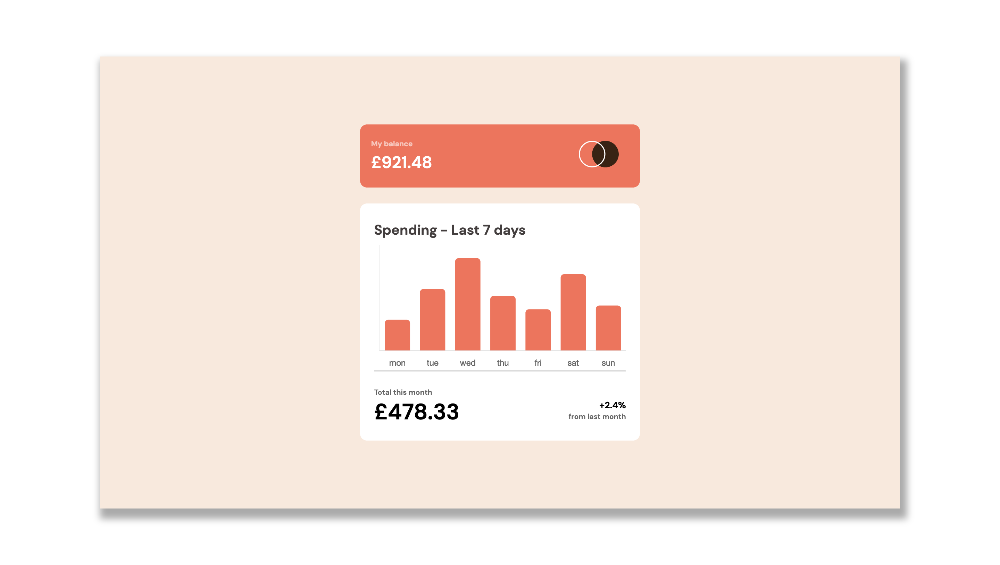
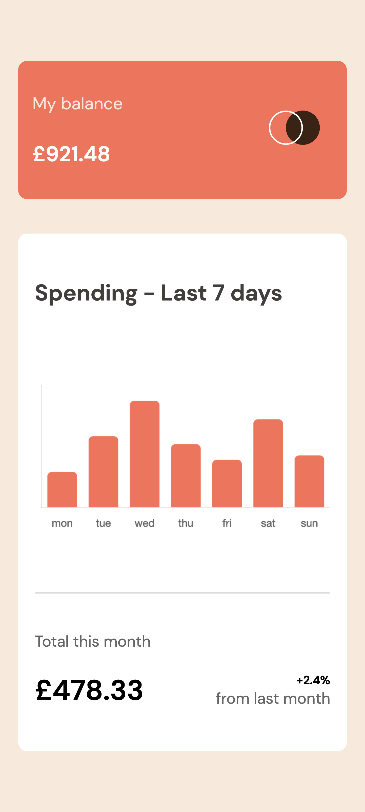

# Frontend Mentor - Expenses chart component solution

This is a solution to the [Expenses chart component challenge on Frontend Mentor](https://www.frontendmentor.io/challenges/expenses-chart-component-e7yJBUdjwt). Frontend Mentor challenges help you improve your coding skills by building realistic projects.

## Table of contents

-   [Overview](#overview)
    -   [The challenge](#the-challenge)
    -   [Screenshot](#screenshot)
    -   [Links](#links)
-   [My process](#my-process)
    -   [Built with](#built-with)
    -   [What I learned](#what-i-learned)
    -   [Continued development](#continued-development)
    -   [Useful resources](#useful-resources)
-   [Author](#author)

## Overview

### The challenge

Users should be able to:

-   View the bar chart and hover over the individual bars to see the correct amounts for each day
-   See the current day’s bar highlighted in a different colour to the other bars
-   View the optimal layout for the content depending on their device’s screen size
-   See hover states for all interactive elements on the page
-   **Bonus**: Use the JSON data file provided to dynamically size the bars on the chart

### Screenshot




### Links

-   Solution URL: [Add solution URL here](https://github.com/c-o-d-e/expenses-chart-component-main)
-   Live Site URL: [Add live site URL here](https://c-o-d-e.github.io/expenses-chart-component-main/)

## My process

### Built with

-   Semantic HTML5 markup
-   CSS custom properties
-   Flexbox
-   Mobile responsive
-   JavaScript Library - Chart.js v3 for the bar chart

### What I learned

```css
 I got the color nearly similar to a prototype solution using https://imagecolorpicker.com/en from my own research
```

```js
const tooltip = {
    displayColors: false,
    callbacks: {
        label: function (context) {
            return yValues[xValues.indexOf(context.label)];
        },
        title: function (context) {
            return;
        },
    },
};

//Understanding how to implement changes to the chart tooltip after reading the documentation was one of the biggest challenges as there is no direct answer to this problem but I loved spending an hour or so reading the documentation of chart.js and understanding how to create a custom object tooltip and make changes to the hover dialog box was very satisfying.

onHover: (event, chartElement) => {
            event.native.target.style.cursor =
                chartElement.length == 1 ? "pointer" : "default";
},

//The above method was not straightforward to find from the documentation as to how to change the style of the mouse cursor when entering the bars of the bar chart, but upon research through stackoverflow and google, I found my way around this problem.

```

### Continued development

I would like to explore more about canvas

### Useful resources

-   [Color picker](https://imagecolorpicker.com/en) - This helped me for getting nearly accurate colors. I really liked this website and will use it going forward.
-   [Chart.js](https://www.chartjs.org/) - There's a plethora of knowledge on how to integrate charts using this library. There is a lot to learn over here.

## Author

-   Github - [Swapnil Rawal](https://github.com/c-o-d-e)
-   LinkedIn - (https://www.linkedin.com/in/swapnil-rawal/)
